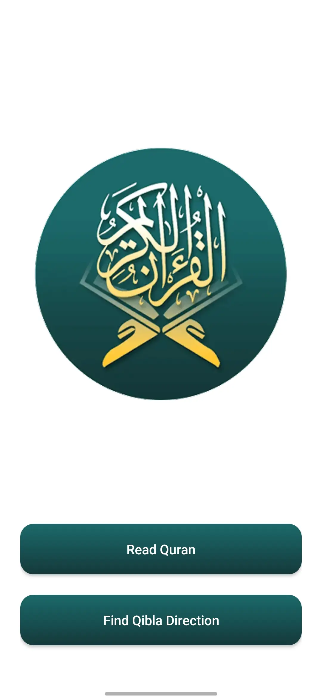
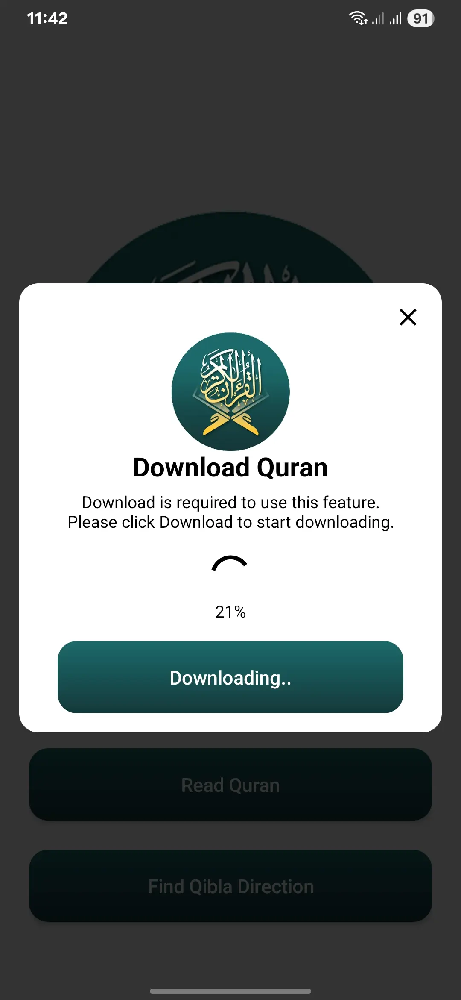
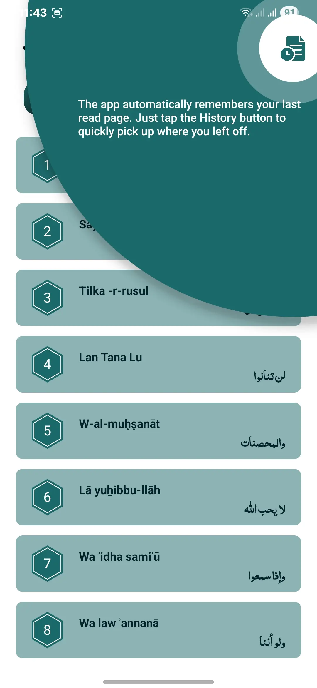
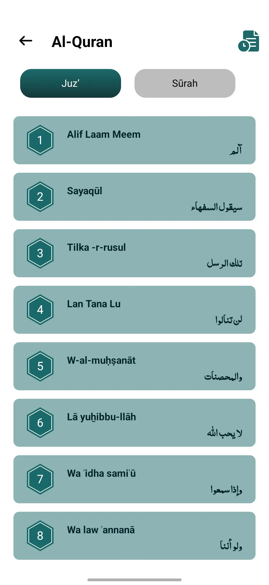
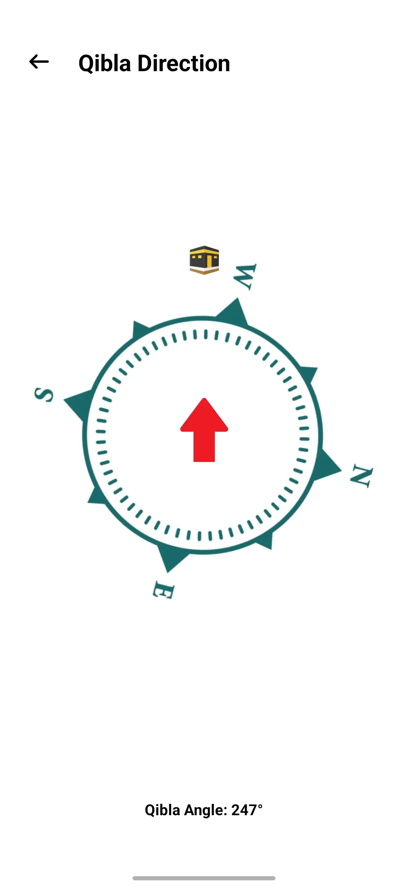

# 📖 Al Quran & Qibla Finder App (Ad-Free)

An open-source Android app that allows users to read the **Holy Quran** and find the **Qibla direction** using a digital compass — all wrapped in a **simple, clean, and ad-free experience**.

---

## 🌟 Features

- 🕋 **Qibla Direction**
  - Compass-based Qibla locator using device sensors.
  - Real-time direction detection with smooth UI.

- 📖 **Quran Reader**
  - Complete Quran (Arabic text).
  - Clean reading interface for spiritual focus.
  - Fast navigation across Surahs.
    
- 🧠 **Auto Save Reading History**
  - Automatically remembers your **last read page**.
  - Instantly resume reading from where you left off.

- 🎯 **Modern MVVM Architecture**
  - Built with **Single Activity Architecture**.
  - **ViewModel**, **LiveData**, **Navigation Component** .

- 🚫 **100% Ad-Free**
  - No ads. No distractions.

---

## 📱 Screenshots

| Home Screen | Download Quran File | Read History | Index Screen | Read Screen | Qibla Screen |
|-------------|----------------------|--------------|---------------|-------------|---------------|
|  |  |  |  |  |  |

---

## 🛠 Tech Stack

- **Language:** Kotlin
- **Architecture:** MVVM + Single Activity
- **UI:** Jetpack Navigation, ViewBinding
- **Permissions:** Runtime Permission API with `ActivityResultLauncher`

---

## 🤝 Contribution

Contributions are warmly welcome! Whether it's a bug fix, new feature, Quran translations, performance improvement, or UI enhancement — every bit helps.

### 🛠 How to Contribute

1.  **Fork** the repository.
2.  **Clone** your fork: `git clone https://github.com/YOUR_USERNAME/Quran_and_Qibla.git`
3.  **Create a new branch**: `git checkout -b feature/your-feature-name` (or `bugfix/your-bug-name`).
4.  **Make your changes**.
5.  **Commit** your changes with a clear message (e.g., `feat: Add new feature` or `fix: Resolve bug`).
6.  **Push** to your fork.
7.  **Open a Pull Request** on the original repository, providing a clear title and description.

---

## 👨‍💻 About Me

I'm a passionate Android developer who loves building clean, user-friendly, and meaningful apps. This project was created to serve the community with an ad-free, modern Islamic utility app.

- 📧 Email: [bilalnasir6860@gmail.com](mailto:bilalnasir6860@gmail.com)  
- 🔗 LinkedIn: [https://www.linkedin.com/in/bilal-nasir-44059319a](https://www.linkedin.com/in/bilal-nasir-44059319a)
  
Feel free to connect with me for collaboration, questions, or feedback!

